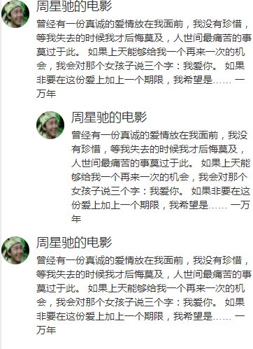
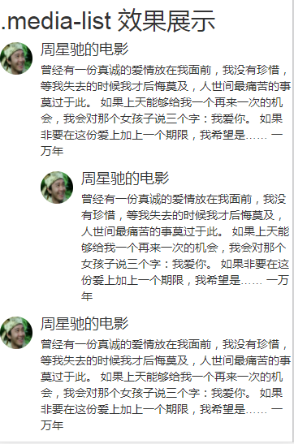

# Bootstrap 多媒体对象（Media Object）

> 多媒体对象（Media Object）。抽象的对象样式用于创建各种类型的组件（比如：博客评论）
> 可以在组件中使用图文混排，图像可以左对齐或者右对齐。媒体对象可以用更少的代码来实现媒体对象与文字的混排
> 媒体对象轻量标记、易于扩展的特性是通过简单的标记应用`class`实现的。

## `class`介绍

* `.media`：该`class`允许将媒体对象里的多媒体（图像、视频、音频）浮动到内容区块的左边或者右边
* `.media-list`：列表，各项内容是无序列表的一部分。可用于评论列表与文章列表
	* `.media-left`：向左浮动
	* `.media-object`：媒体对象
	* `.media-body`：媒体对象所附加的文字信息
	* `.media-heading`：文字信息标题
* 媒体对象进行嵌套，实现缩进效果

## `.media`

##### 示例
```html
<div class="media">
    <a class="media-left" href="#">
        
    </a>
    <div class="media-body">
        <h4 class="media-heading">周星驰的电影</h4>
        曾经有一份真诚的爱情放在我面前，我没有珍惜，等我失去的时候我才后悔莫及，人世间最痛苦的事莫过于此。
        如果上天能够给我一个再来一次的机会，我会对那个女孩子说三个字：我爱你。
        如果非要在这份爱上加上一个期限，我希望是……
        一万年
        <div class="media">
            <a class="media-left" href="#">
                
            </a>
            <div class="media-body">
                <h4 class="media-heading">周星驰的电影</h4>
                曾经有一份真诚的爱情放在我面前，我没有珍惜，等我失去的时候我才后悔莫及，人世间最痛苦的事莫过于此。
                如果上天能够给我一个再来一次的机会，我会对那个女孩子说三个字：我爱你。
                如果非要在这份爱上加上一个期限，我希望是……
                一万年
            </div>
        </div>
    </div>
</div>
<div class="media">
    <a class="media-left" href="#">
        
    </a>
    <div class="media-body">
        <h4 class="media-heading">周星驰的电影</h4>
        曾经有一份真诚的爱情放在我面前，我没有珍惜，等我失去的时候我才后悔莫及，人世间最痛苦的事莫过于此。
        如果上天能够给我一个再来一次的机会，我会对那个女孩子说三个字：我爱你。
        如果非要在这份爱上加上一个期限，我希望是……
        一万年
    </div>
</div>
```
##### 效果


## `.media-list`效果展示

##### 示例
```html
<h2>.media-list 效果展示</h2>
<ul class="media-list">
    <li class="media">
        <a class="media-left" href="#">
            
        </a>
        <div class="media-body">
            <h4 class="media-heading">周星驰的电影</h4>
            曾经有一份真诚的爱情放在我面前，我没有珍惜，等我失去的时候我才后悔莫及，人世间最痛苦的事莫过于此。
            如果上天能够给我一个再来一次的机会，我会对那个女孩子说三个字：我爱你。
            如果非要在这份爱上加上一个期限，我希望是……
            一万年
            <div class="media">
                <a class="media-left" href="#">
                    
                </a>
                <div class="media-body">
                    <h4 class="media-heading">周星驰的电影</h4>
                    曾经有一份真诚的爱情放在我面前，我没有珍惜，等我失去的时候我才后悔莫及，人世间最痛苦的事莫过于此。
                    如果上天能够给我一个再来一次的机会，我会对那个女孩子说三个字：我爱你。
                    如果非要在这份爱上加上一个期限，我希望是……
                    一万年
                </div>
            </div>
        </div>
    </li>
    <li class="media">
        <a class="media-left" href="#">
            
        </a>
        <div class="media-body">
            <h4 class="media-heading">周星驰的电影</h4>
            曾经有一份真诚的爱情放在我面前，我没有珍惜，等我失去的时候我才后悔莫及，人世间最痛苦的事莫过于此。
            如果上天能够给我一个再来一次的机会，我会对那个女孩子说三个字：我爱你。
            如果非要在这份爱上加上一个期限，我希望是……
            一万年
        </div>
    </li>
</ul>
```
##### 效果
<center></center>