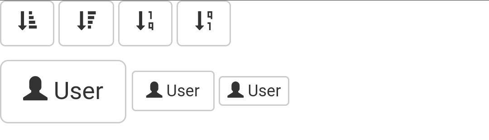
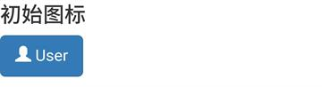
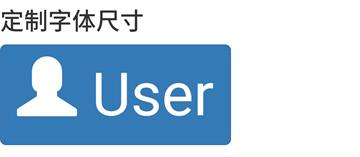
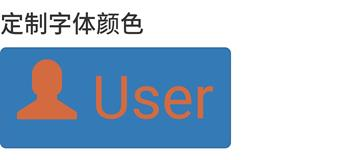

# Bootstrap 字体图标（Glyphicons）

> 字体图标是在WEB项目中使用的图标字体
> `Bootstrap`捆绑了200多种 字体格式的字形

## CSS规则解释

```css
	@font-face {
    font-family: 'Glyphicons Halflings';
    src: url(../fonts/glyphicons-halflings-regular.eot);
    src: url(../fonts/glyphicons-halflings-regular.eot?#iefix) format('embedded-opentype'), url(../fonts/glyphicons-halflings-regular.woff2) format('woff2'), url(../fonts/glyphicons-halflings-regular.woff) format('woff'), url(../fonts/glyphicons-halflings-regular.ttf) format('truetype'), url(../fonts/glyphicons-halflings-regular.svg#glyphicons_halflingsregular) format('svg')
	}

	.glyphicon {
	    position: relative;
	    top: 1px;
	    display: inline-block;
	    font-family: 'Glyphicons Halflings';
	    font-style: normal;
	    font-weight: 400;
	    line-height: 1;
	    -webkit-font-smoothing: antialiased;
	    -moz-osx-font-smoothing: grayscale
	}
```

* `font-face` 规则实际上是在找到 glyphicons 地方**声明 font-family 和位置**。

* `.glyphicon` 声明：
	* 顶部偏移 `1px` 的相对位置，
	* 呈现为 `inline-block`，声明字体
	* 规定 `font-style` 和 `font-weight` 为 `normal`，设置行高为 `1`
	* 使用 `-webkit-font-smoothing: antialiased` 和 `-moz-osx-font-smoothing: grayscale`; 获得跨浏览器的一致性。

## 用法：

* 示例：`<span class="glyphicon glyphicon-search"></span>`
* **注：**图标和文本之间保留适当的空间
* **备注：字体图标当做普通进行处理**

##### 示例：

```html
	<p>
    <button type="button" class="btn btn-default">
        <span class="glyphicon glyphicon-sort-by-attributes"></span>
    </button>
    <button type="button" class="btn btn-default">
        <span class="glyphicon glyphicon-sort-by-attributes-alt"></span>
    </button>
    <button type="button" class="btn btn-default">
        <span class="glyphicon glyphicon-sort-by-order"></span>
    </button>
    <button type="button" class="btn btn-default">
        <span class="glyphicon glyphicon-sort-by-order-alt"></span>
    </button>
	</p>
	<button type="button" class="btn btn-default btn-lg">
	    <span class="glyphicon glyphicon-user"></span> User
	</button>
	<button type="button" class="btn btn-default btn-sm">
	    <span class="glyphicon glyphicon-user"> </span> User
	</button>
	<button type="button" class="btn btn-default btn-xs">
	    <span class="glyphicon glyphicon-user"></span> User
	</button>
```

#### 效果：


<!---->

## 定制字体图标 -- 字体图标的处理方式 等于 字体的处理方式

* 初始字体图标
```html
<h3>初始图标</h3>
<button type="button" class="btn btn-primary btn-lg">
    <span class="glyphicon glyphicon-user"></span> User
</button>
```

<!---->

#### 定制字体图标尺寸

* 直接设置`font-size`属性值
```html
<h3>定制字体尺寸</h3>
<button type="button" class="btn btn-primary btn-lg" style="font-size: 60px">
    <span class="glyphicon glyphicon-user"></span> User
</button>
```

<!---->

#### 定制字体图标颜色

* 直接设置`color`属性值
```html
<h3>定制字体颜色</h3>
<button type="button" class="btn btn-primary btn-lg" style="font-size: 60px;color: rgb(212, 106, 64);">
    <span class="glyphicon glyphicon-user"></span> User
</button>
```

<!---->

#### 应用文本阴影
* 直接设置`text-shadow`属性值
```html
<h3>定制文本阴影</h3>
<button type="button" class="btn btn-primary btn-lg" style="font-size: 60px;color: rgb(212, 106, 64);text-shadow: black 5px 3px 3px;">
    <span class="glyphicon glyphicon-user"></span> User
</button>
```

<!---->