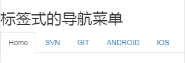
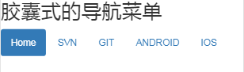
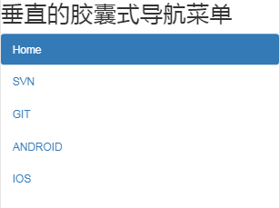
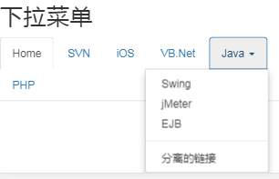
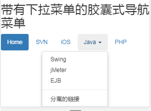
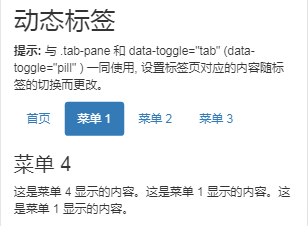

# Bootstrap 导航元素

> `Bootstrap`提供了用于定义导航元素的一些选项。它们使用相同的标记和基类`class="nav"`

> `.disable`表示禁用的标签页

## 标签式的导航菜单

* 以一个带有`class="nav"`的无序元素开始
* 此无序元素添加`class="nav-tabs"`

##### 示例：
```html
<h2>标签式的导航菜单</h2>
<ul class="nav nav-tabs">
   <li class="active"><a href="#">Home</a></li>
    <li><a href="#">SVN</a></li>
    <li><a href="#">GIT</a></li>
    <li><a href="#">ANDROID</a></li>
    <li><a href="#">IOS</a></li>
</ul>
```
##### 效果


## 胶囊式的导航菜单

### 基本的胶囊式导航菜单

* 只需将**标签式的导航菜单中的`.nav-tabs`替换成`.nav-pills`即可**

##### 效果



### 垂直的胶囊式导航菜单

* 在使用`.nav`、`.nav-pills`的同时，使用`.nav-stacked`，让胶囊垂直堆叠

##### 效果



## 下拉菜单

* 添加一个带有`class="dropdown-menu"`的无序列表

### 带有下拉菜单的标签式导航菜单

##### 示例

```html
<h2>下拉菜单</h2>
<ul class="nav nav-tabs">
    <li class="active"><a href="#">Home</a></li>
    <li><a href="#">SVN</a></li>
    <li><a href="#">iOS</a></li>
    <li><a href="#">VB.Net</a></li>
    <li class="dropdown">
        <a class="dropdown-toggle" data-toggle="dropdown" href="#">
            Java <span class="caret"></span>
        </a>
        <ul class="dropdown-menu pull-right">
            <li><a href="#">Swing</a></li>
            <li><a href="#">jMeter</a></li>
            <li><a href="#">EJB</a></li>
            <li class="divider"></li>
            <li><a href="#">分离的链接</a></li>
        </ul>
    </li>
    <li><a href="#">PHP</a></li>
</ul>
```
##### 效果



### 带有下拉菜单的胶囊式导航菜单

* 使用`.nav-pills`

##### 效果


## 随标签页切换、内容发生更改

* 引入`jQuery.js`和`Bootstrap.js`
* 标签页添加`data-toggle="tab"`，标签页切换的事件 **/** 胶囊菜单添加`data-toggle="pill"`，胶囊菜单切换的事件
* `.tab-content`的子元素`.tab-pane`，表示的标签页中对应的内容

##### 示例

```html
<div class="container">
    <h2>动态标签</h2>
    <p><strong>提示:</strong> 与 .tab-pane 和 data-toggle="tab" (data-toggle="pill" ) 一同使用, 设置标签页对应的内容随标签的切换而更改。</p>
    <ul class="nav nav-tabs">
        <li class="active"><a data-toggle="tab" href="#home">首页</a></li>
        <li><a data-toggle="tab" href="#menu1">菜单 1</a></li>
        <li><a data-toggle="tab" href="#menu2">菜单 2</a></li>
        <li><a data-toggle="tab" href="#menu3">菜单 3</a></li>
    </ul>

    <div class="tab-content">
        <div id="home" class="tab-pane fade in active">
            <h3>首页</h3>
            <p>菜鸟教程 —— 学的不仅是技术，更是梦想！！！</p>
        </div>
        <div id="menu1" class="tab-pane fade">
            <h3>菜单 1</h3>
            <p>这是菜单 1 显示的内容。这是菜单 1 显示的内容。这是菜单 1 显示的内容。</p>
        </div>
        <div id="menu2" class="tab-pane fade">
            <h3>菜单 2</h3>
            <p>这是菜单 2 显示的内容。这是菜单 2 显示的内容。这是菜单 2 显示的内容。</p>
        </div>
        <div id="menu3" class="tab-pane fade">
            <h3>菜单 3</h3>
            <p>这是菜单 3 显示的内容。这是菜单 3 显示的内容。这是菜单 3 显示的内容。</p>
        </div>
    </div>
</div>
```
##### 效果

