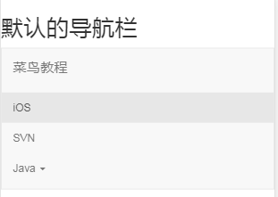
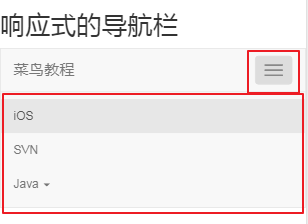

# Bootstrap 导航栏

> 导航栏是`Bootstrap`中的一大功能
> 导航栏在应用或网站中作为导航页头的响应式基础组件
> 导航栏在移动设备的视图中是折叠的，随着可用视口宽度的增加，导航栏也会水平展开
> 在`Bootstrap`导航栏的核心中，导航栏包括了站点名称和基本的导航定义样式

## 默认的导航栏

##### 创建步骤：

1、 向`<nav>`标签添加`.navbar`、`.navbar-default`
2、 向上面的元素添加`role="nevigation"`，有助于增强可访问性
3、 向`<div>`元素添加一个标题`.navbar-header`，内部包含了带有`.navbar-brand`的`<a>`元素。这会让文本看起来更大一号
4、 为了向导航栏添加链接，只需要简单地添加带有`.nav`、`.navbar-nav`的无序列表即可

##### 示例：
```html
<h2>默认的导航栏</h2>
<nav class="navbar navbar-default" role="navigation">
    <div class="container-fluid">
        <div class="navbar-header">
            <a class="navbar-brand" href="#">菜鸟教程</a>
        </div>
        <div>
            <ul class="nav navbar-nav">
                <li class="active"><a href="#">iOS</a></li>
                <li><a href="#">SVN</a></li>
                <li class="dropdown">
                    <a href="#" class="dropdown-toggle" data-toggle="dropdown">
                        Java
                        <b class="caret"></b>
                    </a>
                    <ul class="dropdown-menu">
                        <li><a href="#">jmeter</a></li>
                        <li><a href="#">EJB</a></li>
                        <li><a href="#">Jasper Report</a></li>
                        <li class="divider"></li>
                        <li><a href="#">分离的链接</a></li>
                        <li class="divider"></li>
                        <li><a href="#">另一个分离的链接</a></li>
                    </ul>
                </li>
            </ul>
        </div>
    </div>
</nav>
```
##### 效果：默认的导航栏非响应式的，在屏幕宽度 <= 780px 上会形成堆叠效果


## 响应式的导航栏

* 欲折叠的内容必须包裹在带有`.collapse`和`.navbar-collapse`的`<div>`中
* 折叠起来的导航栏实际上是一个带有`.navbar-toggle`及两个`data-`元素的按钮。
	* 第一个`data-toggle`，用于告诉`Javascript`需要对按钮做什么
	* 第二个`data-target`，指示要切换到哪一个元素
* 折叠后的效果通常是三个带有`.icon-bar`的`<span>`创建的所谓汉堡按钮

##### 示例
```html
<h2>响应式的导航栏</h2>
<nav class="navbar navbar-default" role="navigation">
    <div class="container-fluid">
        <div class="navbar-header">
            <button type="button" class="navbar-toggle" data-toggle="collapse"
                    data-target="#example-navbar-collapse">
                <span class="sr-only">切换导航</span>
                <span class="icon-bar"></span>
                <span class="icon-bar"></span>
                <span class="icon-bar"></span>
            </button>
            <a class="navbar-brand" href="#">菜鸟教程</a>
        </div>
        <div class="collapse navbar-collapse" id="example-navbar-collapse">
            <ul class="nav navbar-nav">
                <li class="active"><a href="#">iOS</a></li>
                <li><a href="#">SVN</a></li>
                <li class="dropdown">
                    <a href="#" class="dropdown-toggle" data-toggle="dropdown">
                        Java <b class="caret"></b>
                    </a>
                    <ul class="dropdown-menu">
                        <li><a href="#">jmeter</a></li>
                        <li><a href="#">EJB</a></li>
                        <li><a href="#">Jasper Report</a></li>
                        <li class="divider"></li>
                        <li><a href="#">分离的链接</a></li>
                        <li class="divider"></li>
                        <li><a href="#">另一个分离的链接</a></li>
                    </ul>
                </li>
            </ul>
        </div>
    </div>
</nav>
```
##### 效果


## 导航栏中的表单

* 导航栏中的表单使用 `.navbar-form` 这确保了表单适当的垂直对齐和在较窄的视口中折叠的行为

##### 示例
```html
<h2>导航栏中的表单</h2>
<nav class="navbar navbar-default" role="navigation">
    <div class="container-fluid">
        <div class="navbar-header">
            <a class="navbar-brand" href="#">菜鸟教程</a>
        </div>
        <form class="navbar-form navbar-left" role="search">
            <div class="form-group">
                <input type="text" class="form-control" placeholder="Search">
            </div>
            <button type="submit" class="btn btn-default">提交</button>
        </form>
    </div>
</nav>
```
##### 效果


## 导航栏中的按钮

* 使用 `.navbar-btn` 向不在 `<form>` 中的 `<button>` 元素添加按钮，**按钮在导航栏上垂直居中**。.navbar-btn 可被使用在 `<a>` 和 `<input>` 元素上。
* **注：** **不要**在 `.navbar-nav` 内的 `<a>` 元素上使用 `.navbar-btsn`

##### 示例
```html
<h2>导航栏中的按钮</h2>
<nav class="navbar navbar-default" role="navigation">
    <div class="container-fluid">
        <div class="navbar-header">
            <a class="navbar-brand" href="#">菜鸟教程</a>
        </div>
        <div>
            <form class="navbar-form navbar-left" role="search">
                <div class="form-group">
                    <input type="text" class="form-control" placeholder="Search">
                </div>
                <button type="submit" class="btn btn-default">提交按钮</button>
            </form>
            <button type="button" class="btn btn-default navbar-btn">
                导航栏按钮
            </button>
        </div>
    </div>
</nav>
```
##### 效果


## 导航栏中的文本
* 导航中包含文本字符串，请使用 `.navbar-text`。这通常与 `<p>` 标签一起使用，确保适当的前导和颜色。

##### 示例
```html
<h2>导航栏中的文本</h2>
<nav class="navbar navbar-default" role="navigation">
    <div class="container-fluid">
        <div class="navbar-header">
            <a class="navbar-brand" href="#">菜鸟教程</a>
        </div>
        <div>
            <p class="navbar-text">Runoob 用户登录</p>
        </div>
    </div>
</nav>
```
##### 效果

