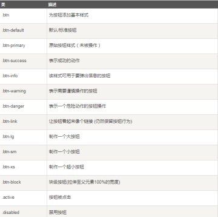
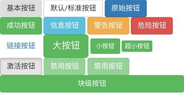

# Bootstrap 按钮

> 任何带有 `class="btn"` 的元素都会继承**圆角灰色按钮的默认外观**

## 按钮样式

**注：**以下样式可用于`<a>`、`<button>`、`<input>`元素


<!---->

#### 示例：
	
	```html
	<!--按钮基本样式-->
	<button type="button" class="btn">基本按钮</button>
	<!-- 默认/标准的按钮 -->
	<button type="button" class="btn btn-default">默认/标准按钮</button>
	<!-- 提供额外的视觉效果，标识一组按钮中的原始动作 -->
	<button type="button" class="btn btn-primary">原始按钮</button>
	<!-- 表示一个成功的或积极的动作 -->
	<button type="button" class="btn btn-success">成功按钮</button>
	<!-- 信息警告消息的上下文按钮 -->
	<button type="button" class="btn btn-info">信息按钮</button>
	<!-- 表示应谨慎采取的动作 -->
	<button type="button" class="btn btn-warning">警告按钮</button>
	<!-- 表示一个危险的或潜在的负面动作 -->
	<button type="button" class="btn btn-danger">危险按钮</button>
	<!-- 并不强调是一个按钮，看起来像一个链接，但同时保持按钮的行为 -->
	<button type="button" class="btn btn-link">链接按钮</button>
	<!--制作一个大按钮-->
	<button type="button" class="btn btn-success btn-lg">大按钮</button>
	<!--制作一个小按钮-->
	<button type="button" class="btn btn-success btn-sm">小按钮</button>
	<!--制作一个超小按钮-->
	<button type="button" class="btn btn-success btn-xs">超小按钮</button>
	<!--制作一个激活状态下的按钮-->
	<button type="button"class="btn btn-default active">激活按钮</button>
	<!--禁用按钮-->
	<button type="button" class="btn btn-success disabled">标准禁用按钮</button>
	<button type="button" class="btn btn-success" disabled="disabled">禁用按钮</button>
	<!--块级按钮-->
	<button type="button" class="btn btn-success btn-block">块级按钮</button>
	```
#### 效果：


<!---->

