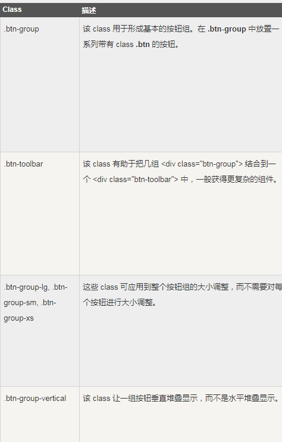
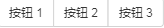
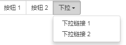
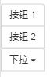

# Bootstrap 按钮组

> 按钮组允许多个按钮被堆叠在同一行上

## 常用class总结



## class="btn-group"

##### 示例
```html
<div class="btn-group">
    <button type="button" class="btn btn-default">按钮 1</button>
    <button type="button" class="btn btn-default">按钮 2</button>
    <button type="button" class="btn btn-default">按钮 3</button>
</div>
```

##### 效果



## class="btn-toolbar'

##### 示例
```html
<div class="btn-toolbar" role="toolbar">
    <div class="btn-group">
        <button type="button" class="btn btn-default">按钮 1</button>
        <button type="button" class="btn btn-default">按钮 2</button>
    </div>
    <div class="btn-group">
        <button type="button" class="btn btn-default">按钮 4</button>
        <button type="button" class="btn btn-default">按钮 5</button>
    </div>
    <div class="btn-group">
        <button type="button" class="btn btn-default">按钮 7</button>
        <button type="button" class="btn btn-default">按钮 9</button>
    </div>
</div>
```
##### 效果


## 嵌套

> 您可以在一个按钮组内嵌套另一个按钮组，即，在一个 .btn-group 内嵌套另一个 .btn-group 。

> 当您想让下拉菜单与一系列按钮组合使用时，就会用到这个。

#### 示例：
```html
<div class="btn-group">
    <button type="button" class="btn btn-default">按钮 1</button>
    <button type="button" class="btn btn-default">按钮 2</button>
    <div class="btn-group">
        <button type="button" class="btn btn-default dropdown-toggle"
                data-toggle="dropdown">
            下拉
            <span class="caret"></span>
        </button>
        <ul class="dropdown-menu">
            <li><a href="#">下拉链接 1</a></li>
            <li><a href="#">下拉链接 2</a></li>
        </ul>
    </div>
</div>
```
#### 效果


## 垂直按钮组

##### 示例
```html
<div class="btn-group-vertical">
    <button type="button" class="btn btn-default">按钮 1</button>
    <button type="button" class="btn btn-default">按钮 2</button>
    <div class="btn-group-vertical">
        <button type="button" class="btn btn-default dropdown-toggle" data-toggle="dropdown">
            下拉
            <span class="caret"></span>
        </button>
        <ul class="dropdown-menu">
            <li><a href="#">下拉链接 1</a></li>
            <li><a href="#">下拉链接 2</a></li>
        </ul>
    </div>
</div>
```

##### 效果
