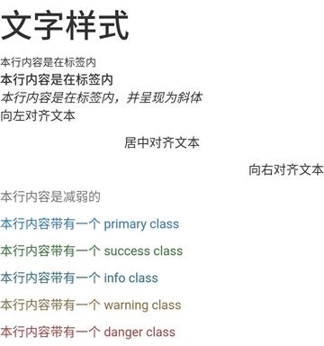
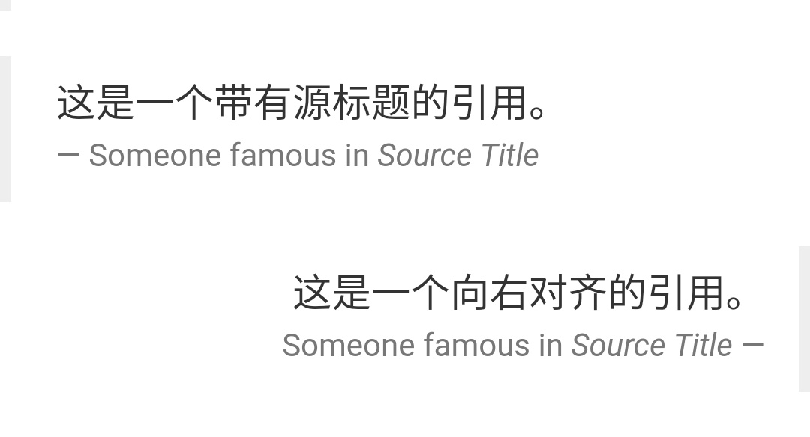

# Bootstrap 排版

> Bootstrap 使用 Helvetica Neue、 Helvetica、 Arial 和 sans-serif 作为其默认的字体栈

## 标题

* Bootstrap框架中定义了**H1 ~ H6**级别的标题

	```html
	<h1>我是标题1 h1</h1>
	```

### 内联子标题

* 如果需要**向任何标题添加一个内联子标题**，只需要简单地在元素两旁添加 `<small>`，或者添加 `class="small"`，这样子您就能得到一个**字号更小的颜色更浅的文本**

	```html
	<h1>我是标题1 h1. <small>我是副标题1 h1</small></h1>
	```

## 引导主体副本

* 为了给**段落添加强调文本**，则可以添加 `class="lead"`，这将得到更大更粗、行高更高的文本

	```html
	<h2>引导主体副本</h2>
	<p class="lead">这是一个演示引导主体副本用法的实例</p>
	```

## 强调

* HTML 的默认强调标签 `<small>`（设置文本为父文本大小的 85%）、`<strong>`（设置文本为更粗的文本）、`<em>`（设置文本为斜体）。
* Bootstrap提供了一些用于强调文本**类**

#### 示例：

	```html
	<small>本行内容是在标签内</small><br>

	<strong>本行内容是在标签内</strong><br>

	<em>本行内容是在标签内，并呈现为斜体</em><br>

	<p class="text-left">向左对齐文本</p>

	<p class="text-center">居中对齐文本</p>

	<p class="text-right">向右对齐文本</p>

	<p class="text-muted">本行内容是减弱的</p>

	<p class="text-primary">本行内容带有一个 primary class</p>

	<p class="text-success">本行内容带有一个 success class</p>

	<p class="text-info">本行内容带有一个 info class</p>

	<p class="text-warning">本行内容带有一个 warning class</p>

	<p class="text-danger">本行内容带有一个 danger class</p>
	```
#### 效果：



## 地址（Address）

* 使用 `<address>` 标签，您可以在网页上显示联系信息。 `<address>` 默认为 `display:block`

## 引用（Blockquote）

* 您可以在任意的 HTML 文本旁使用默认的 `<blockquote>`
* 添加一个 `<small>` 标签来标识引用的来源
* 使用 `class="pull-right"` 或者`class="blockquote-reverse"` 向右对齐引用

#### 示例：
	
	```html
	<blockquote>
    	这是一个带有源标题的引用。
    	<small>Someone famous in <cite title="Source Title">Source Title</cite></small>
	</blockquote>
	<blockquote class="pull-right">
    	这是一个向右对齐的引用。
    	<small>Someone famous in <cite title="Source Title">Source Title</cite></small>
	</blockquote>
	```

#### 效果：



## 更多

* `.text-justify`	设定文本对齐，段落中超出屏幕部分文字自动换行
* `.text-lowercase`	设定文本小写
* `.text-uppercase`	设定文本大写
* `.text-capitalize`	设定单词首字母大写
