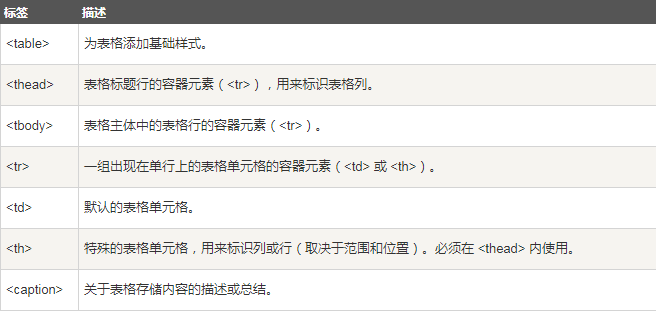
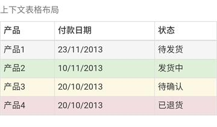

# Bootstrap 表格

> **Bootstrap**提供了清晰的创建表格的布局

## 标签如下：

<!---->

## 作用于**表格`<table>`**的**类class**

* `class="table"`：为任意`<table>`添加基本样式（只有横向分割线）
* `class="table-striped"`：在`<tbody>`内添加斑马线形式的条纹（IE8不支持）
* `class="table-bordered"`：为所有表格的单元格添加边框
* `class="table-hover"`：在`<tbody>`内的任一行启用鼠标悬停状态
* `class="table-condensed"`：让表格更紧凑


## 作用于**表格的行或者单元格`<tr>``<th>``<td>`**的**类class**

* `class="active"`：将悬停的颜色应用应用在行或者单元格上
* `class="success"`:表示成功的操作
* `class="info"`:表示信息变化的操作
* `class="warning"`：表示一个警告的操作
* `class="danger"`：表示一个危险的操作

#### 应用上述样式示例

	```html
	<table class="table table-striped table-bordered 	table-condensed">
    <caption>上下文表格布局</caption>
    <thead>
    <tr>
        <th>产品</th>
        ....
    </tr>
    </thead>
    <tbody>
    <tr class="active">
        <td>产品1</td>
        ....
    </tr>
    ......
    </tbody>
</table>
	```

#### 效果：


<!---->

## 响应式表格

> 通过把任意的 `"class="table"` 包在 `class="table-responsive"` 内，您可以让表格水平滚动以适应小型设备**（小于 768px）**

#### 示例：

	```html
	<div class="table-responsive">
    <table class="table">
        <caption>响应式表格布局</caption>
        <thead>
        <tr>
            <th>产品</th>
            ......
        </tr>
        </thead>
        <tbody>
        <tr>
            <td>产品1</td>
            ......
        </tr>
		......
        </tbody>
    </table>
</div>
	```

#### 效果：

> 表格区域若超出屏幕宽度，可左右移动，表格外其他元素不动。