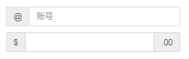
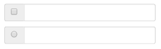
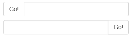
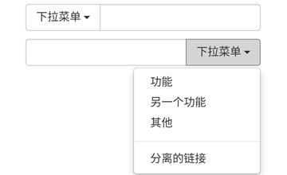

# Bootstrap 输入框组

> 向基于文本的输入框添加作为前缀和后缀的文本或按钮

## 向`class="form-control"`添加前缀或后缀元素步骤

* 把前缀或后缀元素放在一个带有`class="input-group"`的`div`中
* 在相同的`div`内，在`class`为`.input-group-addon`的`<span>`内放置额外的内容
* 把该`<span>`放置在`input`元素的前面或者后面
* 通过向 `.input-group` 添加相对表单大小的 `class`（比如 `.input-group-lg`、`input-group-sm`）来改变输入框组的大小。**输入框中的内容会自动调整大小**。

**注意：**
	
* 为了保持跨浏览器的兼容性，请避免使用 `<select>` 元素，因为它们在 `WebKit` 浏览器中不能完全渲染出效果
* 不要直接向表单组应用输入框组的 `class`，输入框组是一个孤立的组件。

## 简单实例

##### 示例
```html
<form style="padding: 50px 30px;">
    <div class="input-group">
        <span class="input-group-addon">@</span>
        <input type="text" class="form-control" placeholder="账号" id="name">
    </div>
    <p></p>
    <div class="input-group">
        <span class="input-group-addon">$</span>
        <input type="text" class="form-control">
        <span class="input-group-addon">.00</span>
    </div>
</form>
```
##### 效果


## 多选框和多选框

##### 示例
```html
<div>
    <form>
        <div class="row">
            <div class="col-xs-10 col-xs-offset-1">
                <div class="input-group">
					<span class="input-group-addon">
						<input type="checkbox">
					</span>
                    <input type="text" class="form-control">
                </div>
            </div>
        </div>
        <p></p>
        <div class="row">
            <div class="col-xs-10 col-xs-offset-1">
                <div class="input-group">
					<span class="input-group-addon">
						<input type="radio">
					</span>
                    <input type="text" class="form-control">
                </div>
            </div>
        </div>
    </form>
</div>
```
##### 效果


## 按钮插件

> 可以**把按钮作为输入框组的前缀或者后缀元素**
> 
> **不是添加 .input-group-addon class**，您**需要使用** `class="input-group-btn"` 来**包裹按钮**。这是必需的，因为默认的浏览器样式不会被重写。

##### 示例
```html
<div>
    <form role="form">
        <div class="row">
            <div class="col-xs-10 col-xs-offset-1">
                <div class="input-group">
					<span class="input-group-btn">
						<button class="btn btn-default" type="button">
							Go!
						</button>
					</span>
                    <input type="text" class="form-control">
                </div>
            </div>
        </div>
        <p></p>
        <div class="row">
            <div class="col-xs-10 col-xs-offset-1">
                <div class="input-group">
                    <input type="text" class="form-control">
                    <span class="input-group-btn">
						<button class="btn btn-default" type="button">
							Go!
						</button>
					</span>
                </div>
            </div>
        </div>
    </form>
</div>
```
##### 效果


## 带有下拉菜单的按钮

##### 示例
```html
<form role="form">
    <div class="row">
        <div class="col-xs-10 col-xs-offset-1">
            <div class="input-group">
                <div class="input-group-btn">
                    <button type="button"
                            class="btn btn-default dropdown-toggle"
                            data-toggle="dropdown">
                        下拉菜单
                        <span class="caret"></span>
                    </button>
                    <ul class="dropdown-menu">
                        <li><a href="#">功能</a></li>
                        <li><a href="#">另一个功能</a></li>
                        <li><a href="#">其他</a></li>
                        <li class="divider"></li>
                        <li><a href="#">分离的链接</a></li>
                    </ul>
                </div>
                <input type="text" class="form-control">
            </div>
        </div>
    </div>
    <p></p>
    <div class="row">
        <div class="col-xs-10 col-xs-offset-1">
            <div class="input-group">
                <input type="text" class="form-control">
                <div class="input-group-btn">
                    <button type="button"
                            class="btn btn-default dropdown-toggle"
                            data-toggle="dropdown">
                        下拉菜单
                        <span class="caret"></span>
                    </button>
                    <ul class="dropdown-menu pull-right">
                        <li><a href="#">功能</a></li>
                        <li><a href="#">另一个功能</a></li>
                        <li><a href="#">其他</a></li>
                        <li class="divider"></li>
                        <li><a href="#">分离的链接</a></li>
                    </ul>
                </div>
            </div>
        </div>
    </div>
</form>
```
##### 效果
