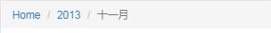

# Bootstrap 面包屑导航（Breadcrumbs）

> 面包屑导航（Breadcrumbs）是一种基于网站层次信息的显示方式

> 面包屑导航是一个带有`.breadcrumb`的无序列表

* `Bootstrap`中的CSS规则：
```css
.breadcrumb > li + li:before{
	color: #CCCCCC;
	content: "/";
	padding: 0 5px
}
```

##### 示例
```html
<ol class="breadcrumb">
    <li><a href="#">Home</a></li>
    <li><a href="#">2013</a></li>
    <li class="active">十一月</li>
</ol>
```

##### 效果

<!---->