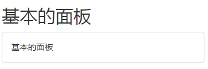

# Bootstrap 面板（Panels）

> 面板组件用于把DOM组件插入到一个盒子中

> 创建一个基本的面板，只需要向`<div>`元素添加`.panel`和`.panel-default`

## 基本的面板

##### 示例
```html
<h2>基本的面板</h2>
<div class="panel panel-default">
    <div class="panel-body">
        基本的面板
    </div>
</div>
```
##### 效果


## 面板标题

* 使用`.panel-heading`可以向面板添加标题容器
* 使用`.panel-title`的`<h1>` ~ `<h6>`，添加预定义样式的标题

##### 示例
```html
<h2>面板标题</h2>
<div class="panel panel-default">
    <div class="panel-heading">
        不带title的面板标题
    </div>
    <div class="panel-body">
        面板内容
    </div>
</div>
<div class="panel panel-default">
    <div class="panel-heading">
        <h3 class="panel-title">
            带有title的面板标题
        </h3>
    </div>
    <div class="panel-body">
        面板内容
    </div>
</div>
```
##### 效果


## 面板脚注

* 添加脚注，需要将按钮或者副文本放在带有`.panel-footer`的`<div>`中

##### 示例
```html
<h2>面板脚注</h2>
<div class="panel panel-default">
    <div class="panel-body">
        这是一个基本面板
    </div>
    <div class="panel-footer">面板脚注</div>
</div>
```
##### 效果


**注意：面板脚注不会从带语境色彩的面板中继承颜色和边框，以为它不是前景中的内容**

## 带语境色彩的面板

* 使用语境状态类`.panel-primary`、`.panel-success`、`panel-info`、`panel-warning`、`panel-danger`，来设置带语境色彩的面板

##### 示例
```html
<h2>带语境色彩的面板</h2>
<div class="panel panel-primary">
    <div class="panel-heading">
        <h3 class="panel-title">面板标题</h3>
    </div>
    <div class="panel-body">
        这是一个基本的面板
    </div>
    <div class="panel-footer">
        面板脚注
    </div>
</div>
```
##### 效果


## 带表格的面板

> 假设有个`<div>`包含`.panel-body`，可以向表格的顶部添加额外的边框来分隔
> 如果没有包含`.panel-body`的`<div>`，则组件会无中断地从面板头部移动到表格
> 使用`.table` class类

##### 示例一
```html
<h2>带表格的面板</h2>
<div class="panel panel-default">
    <div class="panel-heading">
        <h3 class="panel-title">面板标题</h3>
    </div>
    <div class="panel-body">
        这是一个基本的面板
    </div>
    <table class="table">
        <th>产品</th>
        <th>价格</th>
        <tr>
            <td>产品 A</td>
            <td>200</td>
        </tr>
        <tr>
            <td>产品 B</td>
            <td>400</td>
        </tr>
    </table>
</div>
```
###### 效果


##### 示例二
```html
<h2>带表格的面板 - two</h2>
<div class="panel panel-default">
    <div class="panel-heading">
        <h3 class="panel-title">面板标题</h3>
    </div>
    <table class="table">
        <th>产品</th>
        <th>价格</th>
        <tr>
            <td>产品 A</td>
            <td>200</td>
        </tr>
        <tr>
            <td>产品 B</td>
            <td>400</td>
        </tr>
    </table>
</div>
```
##### 效果


## 带列表组的面板

> 可以在任何面板中包含列表组，通过在`<div>`元素中添加`.panel`和`.panel-default`类来创建面板，并在面板中添加列表组

##### 示例
```html
<h2>带列表组的面板</h2>
<div class="panel panel-default">
    <div class="panel-heading">
        面板标题
    </div>
    <div class="panel-body">
        <p>这是一个基本的面板内容</p>
    </div>
    <ul class="list-group">
        <li class="list-group-item">大话西游</li>
        <li class="list-group-item">西游伏魔</li>
        <li class="list-group-item">功夫</li>
        <li class="list-group-item">长江七号</li>
    </ul>
</div>
```
##### 效果
