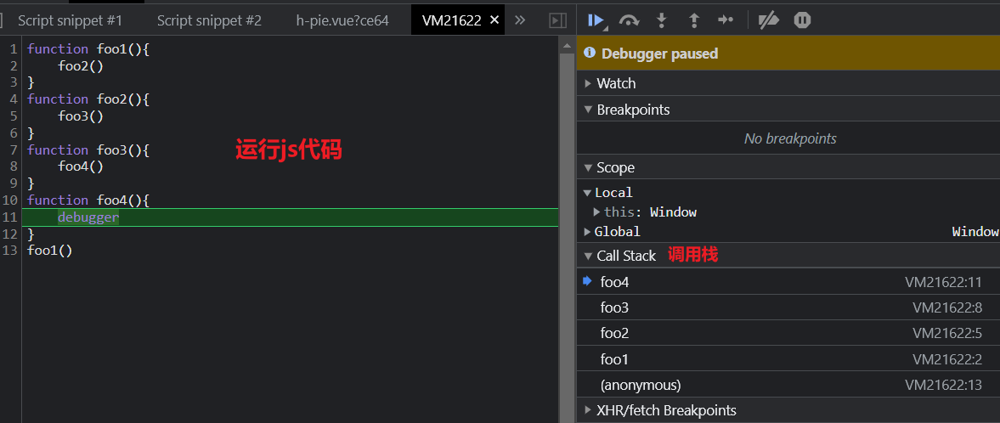

## 知识图谱


## 定义

"JS红宝书" 中有描述：闭包指的是那些引用了另一个函数作用域中变量的函数。简单的一个描述，闭包并非是单一的概念，它涉及到作用域、作用域链、执行上下文、内存管理等概念，需要开发者对闭包有整体的认识。

### 作用域

> 作用域决定了代码区块中变量、函数、对象和其他资源的可见性
> 
> 可分为：全局作用域、函数(局部)作用域 和 块级作用域

#### 函数(局部)作用域：局部变量在函数开始执行时创建，函数执行完后自动销毁

```js
// 表达式函数
let exampleFunction = function () {
    var x = "declared inside function";  // x 只能在 exampleFunction 函数中使用
    console.log(x);
}
exampleFunction();
console.log(x);  // 函数外部无法访问，引发 error：Uncaught ReferenceError: x is not defined

/**
 * 运行结果：
 * 
 * declared inside function
 * Uncaught ReferenceError: x is not defined
 */
```

执行上面代码，变量 `x` 是函数 exampleFunction 作用域内，函数体内可以正常访问，函数外访问报错

#### 全局作用域：在任何地方都能访问

```js
let x = "declared global";
exampleFunction();
// 声明式函数
function exampleFunction() {
    console.log(x);
}
console.log(x);

/**
 * 运行结果：
 * 
 * declared global
 * declared global
 */
```
执行上面代码，变量 `x` 是在全局作用域，exampleFunction 函数在自身函数作用域内未未查找到 x 变量（<u>当前作用域内不存在的变量称为 **自由变量**</u> ），但是它会继续向外扩大查找范围，因此可以在全局作用域内找到变量 x，<u>变量作用域的查找是一个扩散过程，就像各个环节相扣的链条，逐次递进，形成 **作用域链** </u>

#### 块级作用域：块语句由一对大括号界定，用于组合零个或多个语句

> ES6 中增加了通过 `let` 和 `const` 声明变量的块级作用域 

```js
let x = 1;
{
  let x = 2;
  console.log(x); // 输出 2
}
console.log(x); // 输出 1

/**
 * 运行结果：
 * 
 * 2
 * 1
 */
```

#### 拓展知识

##### 变量提升

使用 `var` 关键字声明的变量 或者 声明式函数 会被 声明提升

```js
exampleFunction()
// 表达式函数 （声明变量 + 将函数体赋值给变量）：变量 exampleFunction 提升，但函数体赋值动作不提升，故最后一行调用函数执行了此函数体
var exampleFunction = function () {
  console.log(x)  // undefined
  var x = 'declared inside expression function' // 变量 x 的声明被提升，故上一行输出为 undefined
}
// 声明式函数： 函数整体提升，故第一行调用函数执行了声明式函数的函数体
function exampleFunction () {
  var x = 'declared inside declarative function'
  console.log(x)
}
exampleFunction()

/**
 * 运行结果
 * 
 * declared inside declarative function
 * undefined
 * */
```

##### 暂时性死区：TDZ

由 `let` 和 `const` 声明的变量，在相应花括号形成的作用域中存在一个 **死区**，起始于函数开头，终止于相关变量声明语句的所在行，在这个范围内无法访问使用 `let` 或 `const` 声明的变量

```js
exampleFunction()

function exampleFunction () {
  console.log(x)
  let x = 'declared inside declarative function'
}

/**
 * 运行结果：
 * 
 * Uncaught ReferenceError: Cannot access 'x' before initialization
 */
```

### 执行上下文和调用栈

#### 执行上下文

执行上下文就是当前代码的执行环境/作用域，和前文介绍的作用域相辅相成，但又是两个完全不同的概念。

##### 代码执行的两个阶段：代码预编译阶段 、 代码执行阶段

* 预编译阶段：预编译阶段是前置阶段，这一阶段由编译器将 `JavaScript` 代码编译成可执行的代码。在此阶段有一些重要的步骤：

    * 在预编译阶段进行变量声明
    * 在预编译阶段对变量声明进行提升，但是值为 undefined
    * 在预编译阶段对所有非表达式的函数声明进行提升

* 执行阶段的主要任务是执行代码逻辑，执行上下文在这个阶段会全部创建完成

```js
exampleFunction(10)

// 非表达式函数会在预编译阶段进行函数声明提升，声明的变量作用域在函数外（全局）
function exampleFunction(num){
    console.log(exampleFunction) // 访问的局部变量，声明未赋值，故 undefined
    exampleFunction = num
    console.log(exampleFunction)
    var exampleFunction // 使用 var 声明局部变量，在预编译阶段 声明并提升
}

console.log(exampleFunction) // 访问的全局变量
exampleFunction = 1
console.log(exampleFunction)

/**
 * 运行结果：
 * 
 * undefined
 * 10
 * function foo(num){ console.log(foo) foo = num console.log(foo) var foo }
 * 1
 */
```

作用域在预编译阶段确定，但是作用域链是在执行上下文的创建阶段生成的，因为函数在调用时才会开始创建对应的执行上下文。

执行上下文包括：变量对象、作用域链及this的指向（见文始知识图谱）

###### `JavaScript` 引擎执行机制基本原理：

代码执行的整个过程类似一条生产流水线。第一道工序是在预编译阶段创建变量对象（Variable Object， VO），此时只是创建，而未进行赋值。到了下一道工序代码执行阶段，变量对象会转为激活对象（Active Object， AO），即完成 VO 向 AO 的转换。此时，作用域链也将被确定，它由当前执行环境的变量对象和所有外层已经完成的激活对象组成。这道工序保证了变量和函数的有序访问，即如果未在当前作用域中找到变量，则会继续向上查找直到全局作用域

#### 调用栈

在执行一个函数时，如果这个函数又调用了另外一个函数，而这 "另外一个函数" 又调用了另外一个函数，这样便形成了一系列的调用栈



**注意：** 正常来讲，在函数执行完毕并出栈时，函数内的局部变量在下一个垃圾回收（GC）节点会被回收，该函数对应的执行上下文将会被销毁，这也正是我们在外界无法访问函数内定义的变量的原因。也就是说，只有在函数执行时，相关函数才可以访问该变量，该变量会在预编译阶段被创建，在执行阶段被激活，在函数执行完毕后，其相关上下文会被销毁

## 再谈闭包

闭包并不是 JavaScript 中特有的概念，社区中对闭包的定义也并不完全相同。简单可以理解为：函数嵌套函数时，内层函数引用了外层函数作用域下的变量，并且内层函数在外层函数的外面可以被访问，进而形成闭包。

### 闭包的基本原理

正常情况下外界是无法访问函数内部变量的，函数执行之后，上下文即被销毁。但是在外层函数中，如果我们返回了另一个函数，且这个返回的函数使用了外层函数内的变量，那么外界便能够通过这个返回的函数获取外层函数内部的变量值

---
<br/>
<br/>
<br/>
<br/>
<br/>
<br/>
<br/>
<br/>
<br/>
<br/>
<br/>
<br/>


预编译阶段：表达式函数中，`var` 关键字定义的变量 `exampleFunction` 提升声明（变量提升），但是函数体不会赋值给变量；声明式函数 `exampleFunction` 则会进行创建并整体提升

代码执行阶段：
    第一行调用 `exampleFunction` 函数，则会调用声明式函数的函数体，故打印 `declared inside declarative function`
    第二行则进行变量 `exampleFunction` 赋值函数体，故代码最后一行调用 `exampleFunction` 函数，是调用的表达式函数的函数体，
    表达式函数体内局部作用域中变量 `x` 声明提升，故打印 `undefined`


