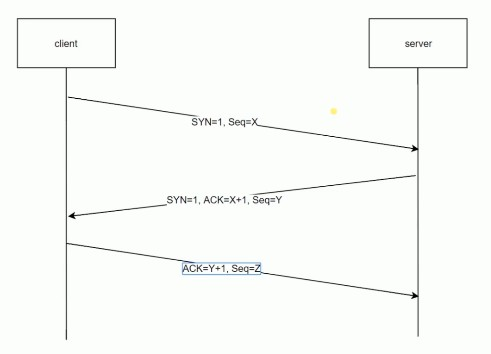
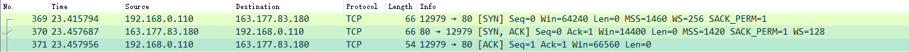

# HTTP协议基础

## 网络协议分层 - 5层网络模型介绍

* **经典五层模型.vsd**

## HTTP协议的发展历史

* HTTP/0.9

	* 只有一个命令 `GET`

	* 没有 `header` 等描述数据的信息

	* 服务器发送完毕，就关闭 `TCP` 连接

* HTTP/1.0

	* 增加了很多命令

	* 增加了 `status code` 和 `header`

	* 多字符集支持、多部分发送、权限、缓存等

* HTTP/1.1

	* 持久连接

	* `pipeline` - 客户端发送并行请求，服务端串行返回请求

	* 增加 `host` 和其他一些命令

* HTTP2

	* 所有数据以二进制传输

	* 同一个连接里面发送多个请求不再需要按照顺序来返回请求

	* 头信息压缩以及推送等提高效率的功能

## HTTP的三次握手

* 规避因网络延时而导致的服务器资源开销

	

	

## URI、URL、URN

* `URI`：统一资源标志符，用来唯一标识互联网上的信息资源，包括： `URL` 和 `URN`

* `URL`：统一资源定位器 `http://host.com:80/path?query=string#hash`

	* `host.com`: 物理服务器

	* `:80`：web服务器

* `URN`：永久统一资源定位符，目前还没有非常成熟的使用方案

## HTTP报文

* 请求报文

	* 请求头

	* 首部

	* 主体

* 响应报文

	* 响应头

	* 首部

	* 主体

## HTTP 方法

用来定义对资源的操作，语义化

## HTTP CODE

定义服务器对请求的处理结果