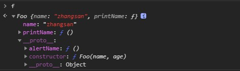
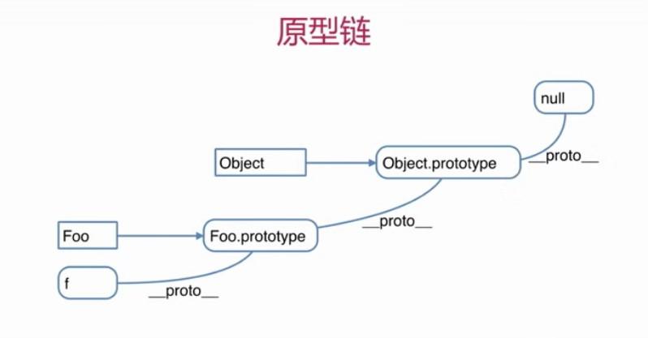

# 原型和原型链

## 理论

* 构造函数

	```JavaScript
	// 构造函数
	function Foo(name, age){
		this.name = name;
		this.age = age;
		this.class = 'class-1'
		// return this // 默认有这一行
	}
	// 创建对象
	var f = new Foo('ZhangSan', 20)
	var f2 = new Foo('Lisi', 22) // 创建多个对象
	```

* 构造函数 - 扩展
	
	* `var a = {}` 其实是 `var a = new Object()` 的语法糖
	* `var a = []` 其实是 `var a = new Array()` 的语法糖 
	* `function Foo(){...}` 其实是 `var Foo = new Function(...)`
	* 使用 `instanceof` 判断一个函数是否是一个变量的构造函数

* 原型规则和实例
		
	* 所有引用类型（数组、对象、函数），都具有对象特性，即可以自由扩展属性（除了null意外）
	* 所有的引用类型（数组、对象、函数），都有一个`__proto__`(隐式原型)属性，属性值是一个普通的对象
	* 所有的函数，都有一个`prototype`(显式原型)属性，属性值也是一个普通的对象
	* 所有的引用类型（数组、对象、函数），`__proto__`属性值是指向它的构造函数的`prototype`属性值
	* 当试图得到一个对象的某个属性时，如果这个对象本身没有这个属性，那么会去它的`__proto__`（即它的构造函数的prototype）中寻找	

	```JavaScript
	// 构造函数
	function Foo(name, age){
		this.name = name
	}
	Foo.prototype.alertName = function(){
		alert(this.name)
	}
	// 创建实例
	var f = new Foo('zhangsan')
	f.printName = function (){
		console.log(this.name)
	}
	// 测试
	f.printName() // 实例f自身属性
	f.alertName() // 实例f没有alertName属性，则去它的`__proto__`中寻找
	```
	
	
* 原型链

	```JavaScript
	// 承接上面的代码
	f.toString() // f.__proto__.__proto__
	```

	

* instanceof

	> 用于判断引用类型属于哪个构造函数的方法
	
	* 判断逻辑
		* f 的 `__proto__`一层一层往上，能否对应到 `Foo.prototype`
		
	```JavaScript
	f instanceof Foo // true
	f instanceof Object // true
	```

## 题目

* 如何准确判断一个变量是数组类型

	`instanceof` 判断

* 写一个原型链继承的例子
	
	```JavaScript
	// 构造函数
	function Elem(id){
		this.elem = document.getElementById(id)
	}
	Elem.prototype.html = function(val){
		var elem = this.elem
		if(val){
			elem.innerHTML = val
			return this // 返回this对象，链式操作
		}else{
			return elem.innerHTML
		}
	}
	
	Elem.prototype.on = function(type, fn){
		var elem = this.elem
		elem.addEventListener(type, fn)
		return this // 返回this对象，支持链式操作
	}
	
	var div1 = new Elem('new_header')
	```

* 描述 new 一个对象的过程

	* 创建一个新对象
	* this指向这个新对象
	* 执行代码，即对this赋值
	* 返回this