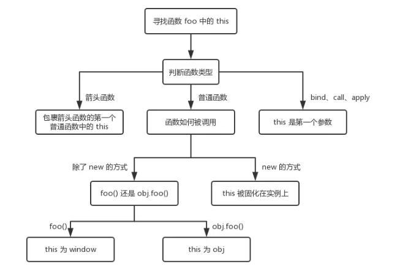

# 作用域与闭包

## 理论

* 执行上下文

	* 变量提升
		
		* 范围：一段 `<script>` 或者一个函数
		
		* 全局：提升函数声明、提升变量声明
		
		* 函数：初始化函数的参数arguments、提升变量声明、提升函数声明、创建作用域链、确定this指向
	
		* 函数声明 和 函数表达式
		
			* 函数声明会被整体提前
		
			```JavaScript
			function fn(){}
			```
		
			* 函数表达式则是变量提前，函数体赋值给变量的操作不会提前
		
			```JavaScript
			var fn = function(){}
			```
* this

	> this要在执行时才能确认值，定义时无法确认

	```JavaScript
	var a = {
		name: 'A',
		fn: function(){
			console.log(this.name)
		}
	}
	a.fn() // this === a
	a.fn.call({name: 'B'}) // this === {name: 'B'}
	var fn1 = a.fn
	fn1() // this === window
	```
	
	* 作为构造函数执行
	
	```JavaScript
	function Foo(name){
		// var this = {} // js执行机制
		this.name = name
		// return this // js执行机制
	}
	var f = new Foo('zhangsan')
	```

	* 作为对象属性执行
	
	```JavaScript
	var obj = {
		name: 'A',
		printName: function(){
			console.log(this.name)
		}
	}
	obj.printName() // this === obj
	```

	* 作为普通函数执行
	
	```JavaScript
	function fn(){
		console.log(this)
	}
	fn() // this === window
	```

	* call apply bind
	
	```JavaScript
	function fn(name){
		console.log(name)
		console.log(this)
	}
	fn.call({x: 100}, 'zhangsan') // this === {x:100}
	```

	* 箭头函数this指向:箭头函数没有自己的this，看其外层的是否有函数
		
		* 如果有，外层函数的this就是内部箭头函数的this
		
		* 如果没有，则this是window。
		
		


* 作用域

	> 作用域决定了代码区块中变量、函数、对象和其他资源的可见性。
	
	* 全局作用域
	
	* 函数作用域
	
	* 块级作用域

		* 代码块（由一对花括号包裹）
		
		* let const 声明的变量不会提升到代码块顶部

		* 在同一作用域内，禁止重复声明

		* `for`循环有有一个特别之处，就是设置循环变量的那部分是一个父作用域，而循环体内部是一个单独的子作用域

		```JavaScript
		for(let i = 0; i < 3; i++){
			let i = 'abc';
			console.log(i)
		}
		// abc
		// abc
		// abc
		```

* 作用域链

	* 父级作用域是在定义的时候就确定的，不是执行时确定

	* 当前作用域不存在的变量称为自由变量，会沿着作用域链找

	```JavaScript
	var a = 100
	function F1(){
		var b = 200
		function F2(){
			var c = 300
			console.log(a) // a 是自由变量
			console.log(b) // b 是自由变量
			console.log(c) 
		}
		F2()
	}
	F1()
	```

* 闭包（需理解作用域）

	* 场景1：函数作为返回值

	```JavaScript
	function fn(){
		var a = 100;
		// 返回一个函数（函数作为返回值）
		return function(){
			console.log(a) // a 是自由变量，沿作用域链找
		}
	}
	// fn1得到一个函数
	var fn1 = fn()
	var a = 200
	fn1() // 100
	```
	
		* 内存泄漏指任何对象在您不再拥有或需要它之后仍然存在。闭包不能滥用，否则会导致内存泄露，影响网页的性能。闭包使用完了后，要立即释放资源，将引用变量指向null。

		```JavaScript
		function outer(){
  			var num=0; //内部变量
	  		return function add(){//通过return返回add函数，就可以在outer函数外访问了
	  			num++;//内部函数有引用，作为add函数的一部分了
	  			console.log(num);
	  		};
	 	}
	 	 var func1 = outer();
	 	 func1();//实际上是调用add函数， 输出1
	 	 func1();//输出2 因为outer函数内部的私有作用域会一	直被占用

	 	 var func2 = outer(); //  每次重新引用函数的时候，闭包是全新的
	  	func2();// 输出1 
	 	 func2();// 输出2  
		```

	* 场景2：函数作为参数传递

## 题目

* 说一下对变量提升的理解（执行上下文理解）

	* 变量定义
	* 函数声明（不同于函数表达式）
	
* 说明`this`几种不同的使用场景

	* 作为构造函数执行
	* 作为对象属性执行
	* 作为普通函数执行
	* call apply bind
	
* 创建10个`<a>`标签，点击的时候弹出来对应的序号（作用域和闭包）
	
	```JavaScript
	var i;
	for(i = 0; i < 10; i++){
		(function(i){
			// 函数作用域
			var a = document.createElement('a')
			a.innerHTML = i + '<br>'
			a.addEventListener('click', function(e){
				e.preventDefault()
				alert(i) // 自由变量
			})
			document.body.appendChild(a)
		})(i)
	}
	```

* 如何理解作用域

	* 自由变量
	* 作用域链，即自由变量的查找
	* 闭包的两个场景

* 实际开发中闭包的应用

	* 封装变量
	* 收敛权限

	```JavaScript
	// 是否是首次加载
	function isFirstLoad(){
		var _list = []
		return function(id){
			if(_list.indexOf(id) >= 0){
				return false
			}else{
				_list.push(id)
				return true
			}
		}
	}
	// 使用
	var firstLoad = isFirstLoad()
	firstLoad(10) // true
	firstLoad(10) // false
	firstLoad(20) // true
	```