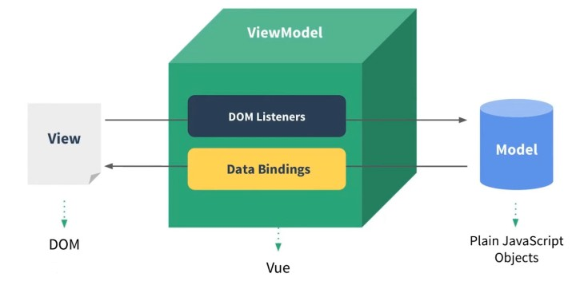

# MVVM 框架或者设计模式概念

* 说一下使用 `jQuery` 和使用框架的区别

	* 数据 和 视图 的分离，解耦（开放封闭原则）

	* 以 数据 驱动视图，只关心数据变化， `DOM` 操作被封装

* 说一下对 `MVVM` 的理解

	* `MVC`： `Model` 数据； `View` 视图、界面； `Controller` 控制器、逻辑处理，主要应用于后端

	

	* `MVVM`：`ViewModel` 是 `Model` 和 `View` 之间的一个桥，相当于一个连接器，结合前端应用场景

	

		* `VUE` 三要素总结

			* 响应式： `vue` 如何监听到 `data` 的每个属性变化

			* 模板引擎：`vue` 的模板如何被解析，指令如何处理

			* 渲染： `vue` 的模板如何被渲染成 `html`？以及渲染过程

* `vue` 中如何实现响应式

	* 什么是 响应式

		* 修改 `data` 属性之后， `vue` 立刻监听到，`vue` 修改属性是异步（是在 `render` 函数中异步）

		* `data` 属性被代理到 `vm` 上

	* `Object.defineProperty` 响应式的核心函数

	```JavaScript
	var obj = {}
	var _name = 'zhangsan'
	Object.defineProperty(obj, 'name', {
		get: function () {
		  console.log('get', _name)
		  return _name
		},
		set: function (newVal) {
		  console.log('set', newVal)
		  _name = newVal
		}
	})
	```

	* 模拟实现

	```JavaScript
	var vm = {}
	var data = {
		name: 'zhangsan',
		age: 20
	}
	
	var key, value
	for (key in data) {
		// 命中闭包。新建一个函数，保证 key 的独立作用域
		(function (key) {
	  		Object.defineProperty(vm, key, {
	    		get () {
					console.log('get', data[key]) // 监听
					return data[key]
	    		},
	    		set (v) {
					console.log('set', v) // 监听
					data[key] = v
	    		}
	  		})
		})(key)
	}
	```

* `vue` 如何解析模板

	* 模板是什么

		* 本质：字符串

		* 有逻辑：如 `v-if`、`v-for` 等

		* 与 `html` 格式很像，但有很大区别

		* 最终还要转换为 `html` 来显示

		* 模板最终必须转换成 `JS` 代码，理由：

			* 有逻辑（`v-if`、`v-for`），必须用 `JS` 才能实现（图灵完备语言）

			* 转换为 `html` 渲染页面，必须用 `JS` 才能实现

			* 因此，模板最终转换成一个 `JS` 函数（`render`函数）

	* `render` 函数

		* `with` 用法（**工作中，个人代码，不建议使用**）

		```JavaScript
		var obj = {
		    name: 'zhangsan',
		    age: 20,
		    getAddress () {
		      alert('beijing')
		    }
	  	}
		function fn1 () {
			with (obj) {
			  alert(name)
			  alert(age)
			  getAddress()
			}
		}
		```

		* 模板中所有信息都包含在 `render` 函数中

		* 模板中用到的 `data` 中的属性，都变成了 `JS` 变量

		* 模板中的 `v-model`、`v-for`、`v-on` 都变成了 `JS` 逻辑

		* `render` 函数返回 `vnode`

		* `this` 即 `vm`

		```JavaScript
		/* HTML */
		<!DOCTYPE html>
		<html lang="en">
		<head>
		  <meta charset="UTF-8">
		  <title>TODO-LIST VUE</title>
		  <script src="https://cdn.bootcss.com/vue/2.6.10/vue.min.js"></script>
		</head>
		<body>

		/* 模板 */
		// ------------------------------
		<div id="app">
		  <div>
		    <input type="text" v-model="title">
		    <button @click="add">Submit</button>
		  </div>
		  <div>
		    <ul>
		      <li v-for="item in list">
		        {{item}}
		      </li>
		    </ul>
		  </div>
		</div>
		// ------------------------------

		<script>
		  var vm = new Vue({
		    el: '#app',
		    data: {
		      title: '',
		      list: []
		    },
		    methods: {
		      add: function () {
		        this.list.push(this.title)
		        this.title = ''
		      }
		    }
		  })
		</script>
		</body>
		</html>

		/* 模板生成的render函数 */

		with (this) { // this 就是 vm
			return _c('div',
			    { attrs: { "id": "app" } },
			    [
			      _c('div',
			        [
			          _c('input',
			            {
			              directives: [{
			              name: "model",
			              rawName: "v-model",
			              value: (title),
			              expression: "title"
			              }],
			              attrs: { "type": "text" },
			              domProps: { "value": (title) },
			              on: {"input": function ($event) {
			                if ($event.target.composing) return
			                  title = $event.target.value
			                }
			              }
			            }
			          ),
			          _v(" "),
			          _c('button',
			            {on: { "click": add } },
			            [_v("Submit")])
			        ]
			      ),
			      _v(" "),
			      _c('div',
			        [
			          _c('ul', _l((list), function (item) {
			                return _c('li', [_v("\n        " + _s(item) + "\n      ")])
			              }
			            )
			          )
			        ]
			      )
			    ]
			)
		}

		```

	* `render` 函数与 `vdom`

		* `vm._c` 其实就相当于 `snabbdom` 中的 `h` 函数

		* `render` 函数执行之后，返回的是 `vnode`
		
		```JavaScript
		// updateConponent 中实现了 vdom 的 patch

		// 页面首次渲染执行 updateComponent

		// data 中每次修改属性，执行 updateComponent

		function updateComponent(){
			// vm._render() 即 根据模板生成的 render 函数
			vm._update(vm._render())
		}

		vm._update(vnode){
			const prevVnode = vm._vnode
			vm._vnode = vnode
			if (!prevVnode){
				vm.$el = vm.__patch__(vm.$el, vnode)
			} else {
				vm.$el = vm.__patch__(preVnode, vnode)
			}
		}
		```

* `vue` 的整个实现流程

	* 解析模板成 `render` 函数

	* 响应式开始监听

	* 首次渲染，显示页面，且绑定依赖(`getter` 和 `setter`)

	* `data` 属性变化，触发 `re-render`
