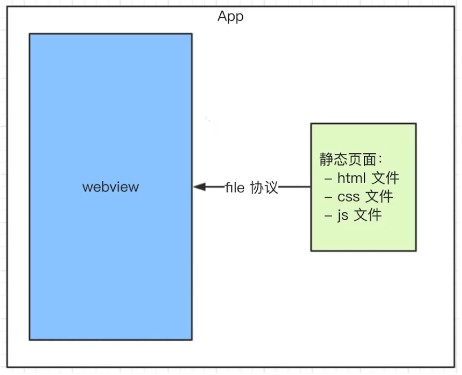

# hybrid

> 客户端和前端混合开发

> 不是所有场景都适合使用 `hybrid`

* 使用 `NA`：体验要求极致，变化不频繁

* 使用 `hybrid`：体验要求高，变化频繁

* 使用 `h5`：体验无要求，不常用

* `hybrid` 是什么，为何用 `hybrid`

	* `hybrid` 即 "混合"，即前端和客户端的混合开发

	* 存在价值，为何会用 `hybrid`
	
		* 可以快速迭代更新（无需 `app` 审核）

		* 体验流畅 （和 `NA` 的体验基本类似）

		* 减少开发和沟通成本，多端共用一套代码

	* `webview` 一类组件的统称

		* 是 `app` 中的一个组件

		* 用于加载 `h5` 页面，即一个小型的浏览器内核

	* `file://` 协议

		* `file://`协议，加载本地资源，快

		* `http(s)`协议，网络加载，慢

	* `hybrid` 实现流程
	
		* 前端做好静态页面（`html`、`js`、`css`），将文件交给客户端

		* 客户端拿到前端静态页面，以文件形式存储到 `app` 中

		* 客户端再一个 `webview` 中，使用 `file` 协议加载静态页面

		

* 介绍一下 `hybrid` 更新和上线的流程

	> 要替换每个客户端的静态文件

	> 只能客户端来做

	> 客户端去 `server` 端下载最新的静态文件

	> 前端维护 `server` 端的静态文件

	* 分版本，资源存在版本号

	* 将静态文件压缩成 `zip` 包，上传到服务端

	* 客户端每次启动，都去服务端检查版本号

	* 如果服务端版本号大于客户端版本号，就去下载最新的 `zip` 包

	* 下载完之后解压包，然后将现有文件覆盖

* `hybrid` 和 `h5` 的主要区别

	* 优点

		* 体验更好，跟 `NA` 体验基本一致

		* 可快速迭代，无需 `app` 审核

	* 缺点

		* 开发成本高。联调、测试、查 `bug` 都比较麻烦

		* 运维成本高

	* 适用场景

		* `hybrid`：产品的稳定功能，体验要求高，迭代频繁。适合产品型

		* `h5`：单次的运营活动或不常用功能。适合运营型

* `hybrid` 中嵌套的 `webview` 如何获取指定的内容

	* 不能使用 `ajax` 获取。 第一：跨域（可解决）;第二：速度慢

	* 客户端获取新闻内容，然后 `JS` 通讯拿到内容，再渲染
	
* 前端 `JS` 和客户端如何通讯

	* 基本形式

		* `JS` 访问客户端能力，传递参数和回调函数

		* 客户端通过回调函数返回内容

	* `schema` 协议 - 前端和客户端通讯的约定

	```JavaScript
	/* 封装 schema 协议 */	
	(function (window, undefined) {
		// 调用 schema 的封装
		function _invoke (action, data, callback) {
			// 拼装 schema 协议
			var schema = 'my://utils/' + action
			// 拼接参数
			schema += '?a=a'
			var key
			for (key in data) {
			  if (data.hasOwnProperty(key)) {
			    schema += '&' + key + '=' + data[key]
			  }
			}
			// 处理callback
			var callbackName = ''
			if (typeof callback === 'string') {
			  callbackName = callback
			} else {
			  callbackName = action + Date.now()
			  window[callbackName] = callback
			}
			schema += '&callback=' + callbackName
			
			// 触发
			var iframe = document.createElement('iframe')
			iframe.style.display = 'none'
			iframe.src = schema // important
			var body = document.body
			body.appendChild(iframe)
			setTimeout(function () {
			  body.removeChild(iframe)
			  iframe = null
			})
		}
	
		window.invoke = {
			share: function (data, callback) {
			  _invoke('shard', data, callback)
			},
			scan: function (data, callback) {
			  _invoke('scan:', data, callback)
			},
			login: function (data, callback) {
			  _invoke('login', data, callback)
			}
		}
	})(window)

	/* 前端调用 */
	<script>
		document.getElementById('btn1').addEventListener('click', function () {
			// invokeScan()
			window.invoke.scan({}, function () {
			})
		})
		document.getElementById('btn2').addEventListener('click', function () {
			// invokeScan()
			window.invoke.share({
			  title: 'xxx',
			  content: 'yyy'
			}, function (res) {
				if (res.errno === 0) {
					alert('分享成功')
				} else {
					alert(res.message)
				}
			})
		})
	</script>
	```