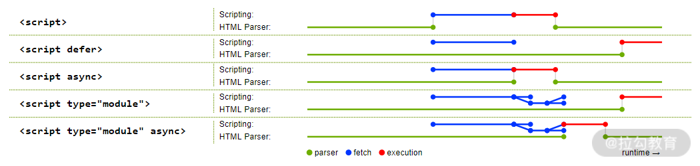
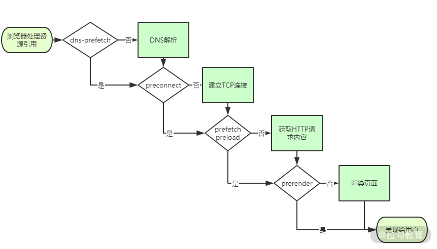

# HTML标签冷知识

## 性能优化

性能优化是前端开发中避不开的问题，性能问题无外乎两方面的原因： 渲染速度慢，请求时间长。性能优化虽然涉及很多复杂的原因和解决方案，但其实只要通过合理地使用标签，就可以在一定程度上提升渲染速度以及减少请求时间

### script标签：调整加载顺序提升渲染速度

由于浏览器的底层运行机制，渲染引擎在解析HTML时，若遇到script标签引用文件，则会暂停解析过程，同时通知网络线程加载文件，文件加载后会切换至JavaScript引擎来执行对应代码，代码执行完成后切换至渲染引擎继续渲染页面。
在这一过程中可以看到，页面渲染过程中包含了请求文件以及执行文件的时间，但页面的首次渲染可能并不依赖这些文件，这些请求和执行文件的动作反而延长了用户看到页面的时间，从而降低了用户体验。
为了减少这些时间损耗，可以借助script标签的3个属性来实现：

* **async**属性：立即请求文件，但不阻塞渲染引擎，而是文件加载完毕后阻塞渲染引擎并立即执行文件内容。
* **defer**属性：立即请求文件，但不阻塞渲染引擎，等到解析完HTML之后再执行文件内容
* **HTML5标准type属性**：对应值为 **module** 。让浏览器按照 **ECMA Script6** 标准将文件当做模块进行解析，默认阻塞效果同 **defer**，也可以配合 **async** 在请求完成后立即执行

	

**注意：**当渲染引擎解析 HTML 遇到 script 标签引入文件时，会立即进行一次渲染。所以这也就是为什么构建工具会把编译好的引用 JavaScript 代码的 script 标签放入到 body 标签底部，因为当渲染引擎执行到 body 底部时会先将已解析的内容渲染出来，然后再去请求响应的 JavaScript 文件。如果是内联脚本（即不通过 src 属性引用外部脚本文件直接在 HTML 编写 JavaScript 代码的形式），渲染引擎则不会渲染

### link标签：通过预处理提升渲染速度

在我们对大型单页应用进行性能优化时，也许会用到按需加载的方式，来加载对应的模块，但如果能合理利用link标签的rel属性值进行预加载，就能进一步提升渲染速度

* **dns-prefetch**：当 link 标签的 rel 属性值为 dns-prefetch 时，浏览器会对某个域名预先进行 DNS 解析并缓存。这样，当浏览器再请求同域名资源的时候，能省去从域名查询 IP 的过程，从而减少时间损耗。
* **preconnect**：让浏览器在一个 HTTP 请求正式发给服务器前预先执行一些操作，这包括 DNS 解析、TLS 协商、TCP 握手，通过消除往返延迟来为用户节省时间
* **prefetch/preload**：两个值都是让浏览器预先下载并缓存某个资源，但不同的是， prefetch 可能会在浏览器忙时被忽略，而 preload 则是一定会被预先下载
* **prerender**：浏览器不仅会加载资源，还会解析执行页面，进行预渲染

	
	
浏览器获取资源文件的流程

### 搜索引擎优化

合理的使用 meta 标签和 link 标签，恰好能让搜索引擎更好地理解和收录我们的页面

#### meta标签：提取关键信息

* 通过 meta 标签可以设置页面的描述信息，从而让搜索引擎更好的展示搜索结果
* 使用关键字，即使页面其他地方没有包含搜索内容，也可以被搜索到。推荐使用**Google Trends、站长工具**等来进行关键字挑选